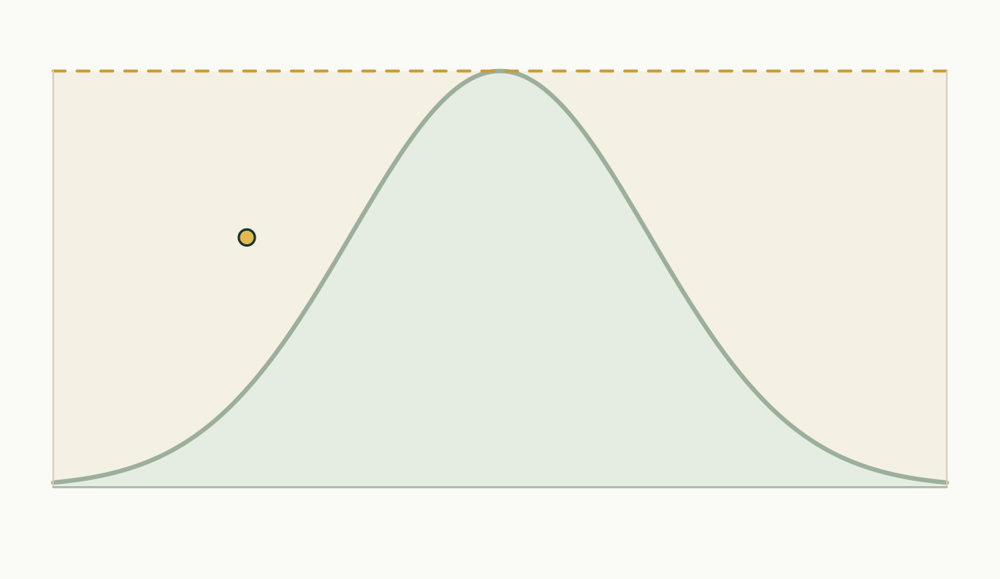
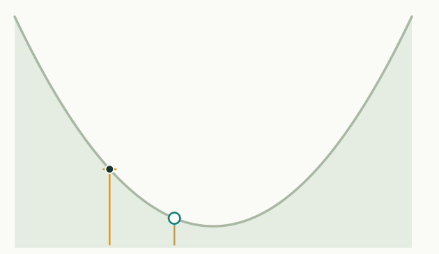
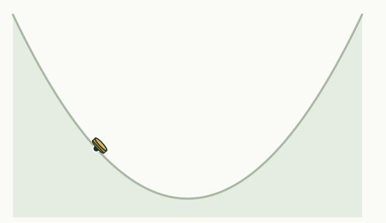

## The likelihood

{.step}

Each observation gets a distribution around the model output,
$p(\text{data point } i \mid \theta)$. If they are conditionally independent given $\theta$:

$$\log p(\text{data} \mid \theta) = \sum_{i} \log p(\text{data point } i \mid \theta)$$

##  {.center}

{.tall}

$$p(\theta \mid \text{data}) \propto p(\text{data} \mid \theta)\, p(\theta)$$

## Why sample?

{.step}

Samples $\theta_1$, $\theta_2$, $\theta_3$, $\ldots$ let us calculate parameter means, quantiles etc. and make predictions from the model.

## Rejection sampling

{.step}

It draws from the posterior, but the acceptance rate collapses as the number of
parameters grows.

## Metropolis-Hastings

{.step}

Propose $\theta^*$ from where you are, and accept with probability

$$r = \min\left(1, \frac{f(\theta^*)\,q(\theta \mid \theta^*)}{f(\theta)\,q(\theta^* \mid \theta)}\right)$$

## NUTS

{.step}

Hamiltonian Monte Carlo uses the **gradient** to move with the shape of the
posterior, and [NUTS]{.alert} adapts the step size and stops each trajectory
when it turns back on itself. Usually no proposal tuning at all, and therefore
a sensible default if it can be used.

##  Questions? {background-color="#447099" transition="fade-in"}

Anything from yesterday worth revisiting.

#

[Introduction](../introduction.qmd) &middot;
[MCMC](../mcmc.qmd)
