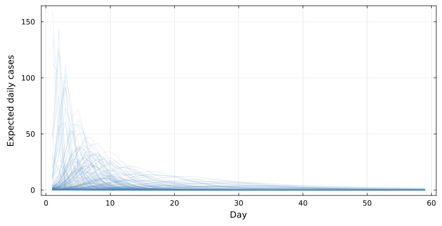
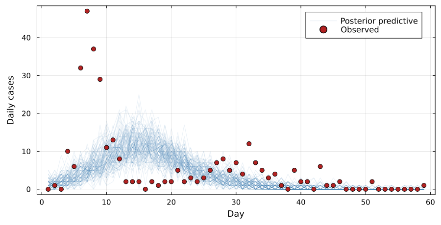

## Have the chains converged?

{.step}

Straight, plump at both ends, several chains on top of each other.
$\hat{R} = \sqrt{\hat{V}/W}$ compares the variance between chains with the
variance within them. We want this to be below 1.01.

## Before you see the data

{.step}

$\theta^{(i)} \sim p(\theta), \qquad y^{(i)} \sim p(y \mid \theta^{(i)})$

Two hundred draws from our priors. Most burn through the population in a week.

## After fitting

{.step}

$\theta^{(i)} \sim p(\theta \mid y), \qquad y^{\text{rep},(i)} \sim p(y \mid \theta^{(i)})$

The fit misses both waves: a flatter, later, smaller epidemic that splits the
difference between them.

## A stochastic model makes the likelihood an integral

{.step}

$$p(\text{data} \mid \theta) = \int_{X} p(\text{data} \mid X, \theta)\, p(X \mid \theta)$$

Run a [stochastic]{.alert} model twice and you get two different trajectories.
One $\theta$ no longer gives one curve to hold against the data; it gives a
distribution of them, and the likelihood is the average over that distribution.
Estimating that average, for [SEIT4L]{.alert}, is where today starts.

##  Questions? {background-color="#447099" transition="fade-in"}

Anything from yesterday worth revisiting.

#

[MCMC diagnostics](../mcmc_diagnostics.qmd) &middot;
[Model checking](../model_checking.qmd) &middot;
[SEITL](../seitl.qmd)
