## Where we are

We know how to get a posterior when the model is **deterministic**:

$$p(\theta \mid y) \propto p(y \mid \theta)\, p(\theta)$$

. . .

One $\theta$ gives one trajectory, so the likelihood is one calculation.

. . .

Stochastic models break this.

## The marginal likelihood

The model has a latent state $x$, the trajectory it actually took, which we do not observe.

$$p(y \mid \theta) = \int p(y \mid x, \theta)\, p(x \mid \theta) \, \mathrm{d}x$$

Getting the likelihood of $\theta$ means averaging over every trajectory the model could have taken.

## The deterministic case

$\theta$ determines the trajectory exactly:

$$p(y \mid \theta) = \int p(y \mid x, \theta)\, \delta\big(x - f(\theta)\big) \, \mathrm{d}x
= p\big(y \mid x = f(\theta), \theta\big)$$

. . .

The integral collapses to a single point.
That is why everything has worked so far.

## The stochastic case

$$p(y \mid \theta) = \int p(y \mid x, \theta)\, p(x \mid \theta) \, \mathrm{d}x$$

. . .

The integral runs over every sequence of events the model could produce, and the times at which they happen.

# Estimating the integral

## One draw

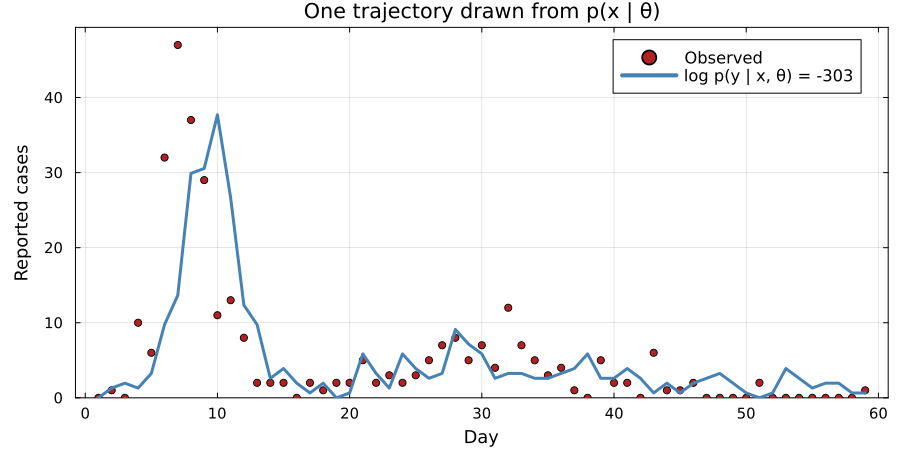{.pfwide}

Simulating the model draws $x_1 \sim p(x \mid \theta)$.
Scoring it against the data gives $p(y \mid x_1, \theta)$, an unbiased but very noisy estimate of the likelihood.

## Many draws

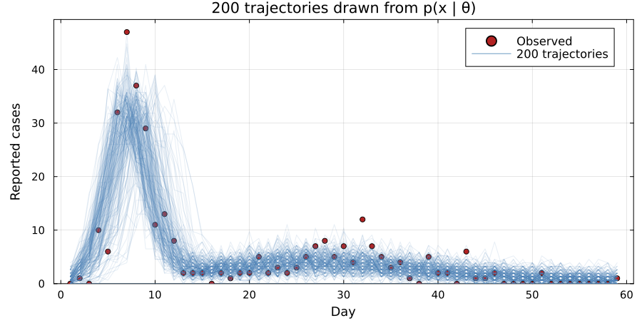{.pfwide}

$$\hat{p}(y \mid \theta) = \frac{1}{J}\sum_{j=1}^{J} p(y \mid x_j, \theta)$$

Each trajectory is one way the epidemic could have gone.
Its [weight]{.alert} is the probability of the data if it had gone that way.
A trajectory with a higher weight counts for more in the average.

## One weight per trajectory {.smaller}

{.pfwide}

One weight has to cover all 59 observations.
Two of the 200 hold 88% of the total.

## The estimate gets noisier every day {.smaller}

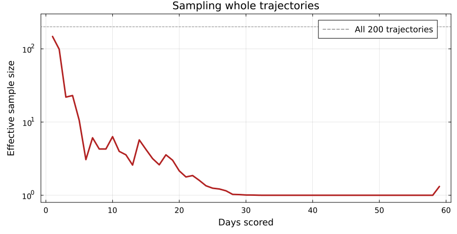{.pfwide}

Scored on day 1 alone, the effective sample size is close to all 200.
By day 10 it is 6, and by day 30 about 1.

. . .

The estimate then rests on one or two draws, so it changes wildly from run to run.

. . .

The fall is close to a straight line on a log scale, so a bigger $J$ cannot keep up.

# The particle filter

## The likelihood factorises

$$p(y \mid \theta) = p(y_1 \mid \theta)\; p(y_2 \mid y_1, \theta) \cdots
p(y_T \mid y_{1:T-1}, \theta)$$

Each factor asks how well the model predicted one day, given everything before it.

. . .

We track the possible trajectories with a set of $J$ [particles]{.alert}.

## Initialise

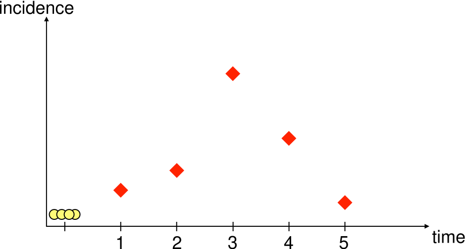{.pfwide}

$J$ particles start from the same state, each with weight $1/J$.

## Propagate

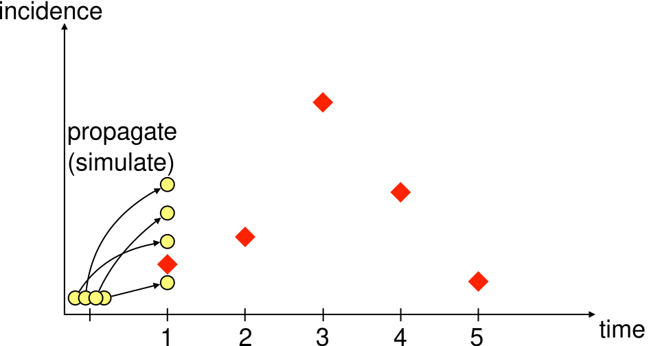{.pfwide}

Every particle takes one step of the model.

## Weigh

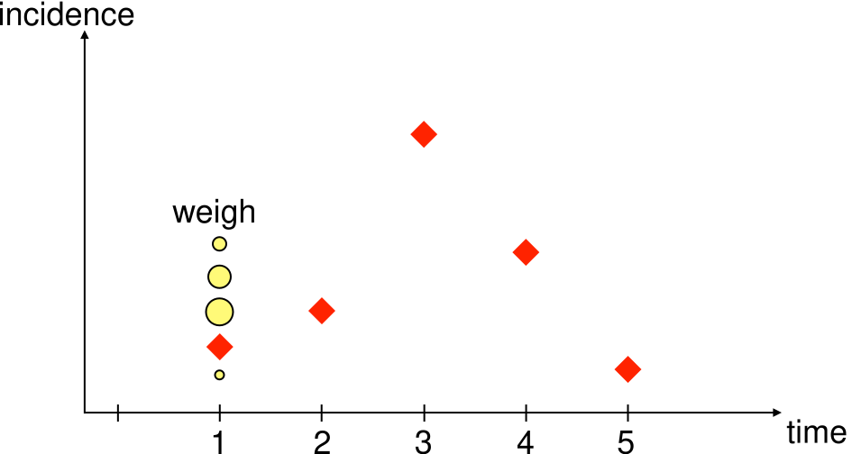{.pfwide}

The weight is the probability of today's count under that particle, $w_{t,j} = p(y_t \mid x_{t,j}, \theta)$.

## Weighting alone changes nothing

Let the weights accumulate across days, so each particle carries the product of its own weights:

$$\frac{1}{J}\sum_{j} \prod_{t} w_{t,j}
= \frac{1}{J}\sum_{j} p(y \mid x_j, \theta)$$

. . .

That is the estimator we started with.
The factorisation gives us a point between days at which to discard particles.

. . .

Otherwise all 200 are simulated to day 59, including the 198 that contribute almost nothing.

## Resample

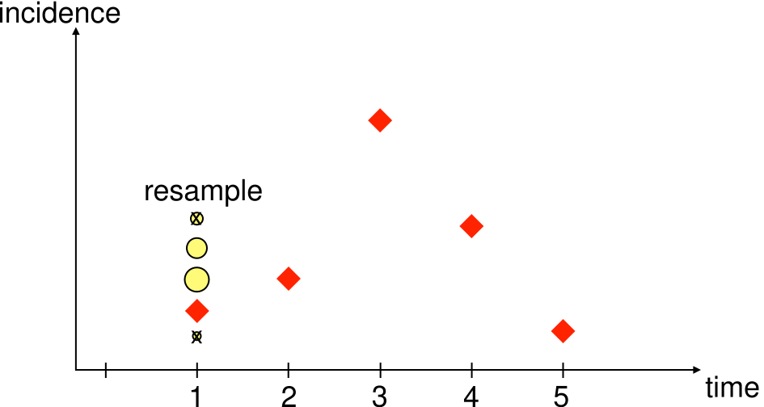{.pfwide}

Draw $J$ particles from the current ones in proportion to their weights.
Every weight resets to $1/J$.

## Five days of propagate, weigh, resample

::: {.r-stack}
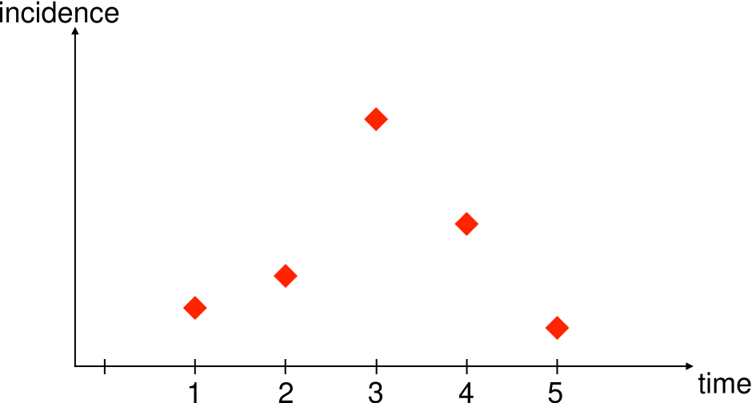{.pfwide .fragment .fade-out fragment-index=1}
{.pfwide .fragment .current-visible fragment-index=1}
{.pfwide .fragment .current-visible fragment-index=2}
{.pfwide .fragment .current-visible fragment-index=3}
{.pfwide .fragment .current-visible fragment-index=4}
{.pfwide .fragment .current-visible fragment-index=5}
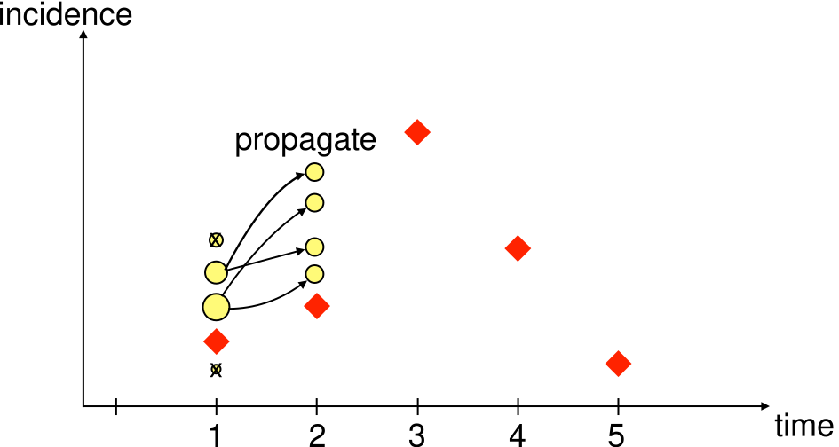{.pfwide .fragment .current-visible fragment-index=6}
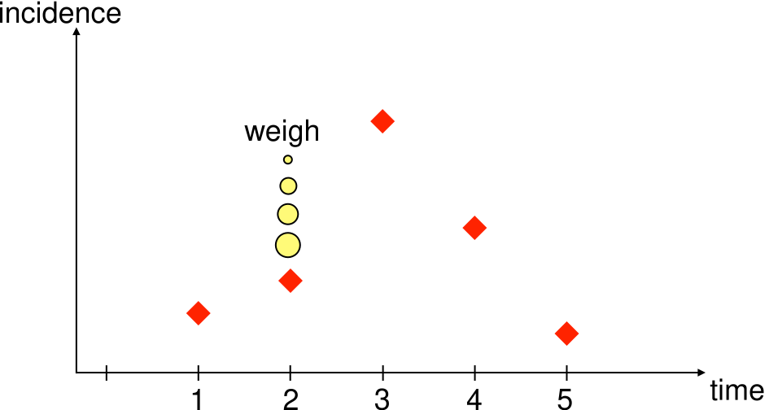{.pfwide .fragment .current-visible fragment-index=7}
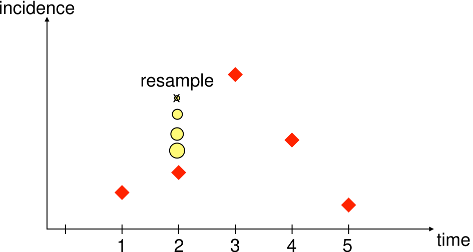{.pfwide .fragment .current-visible fragment-index=8}
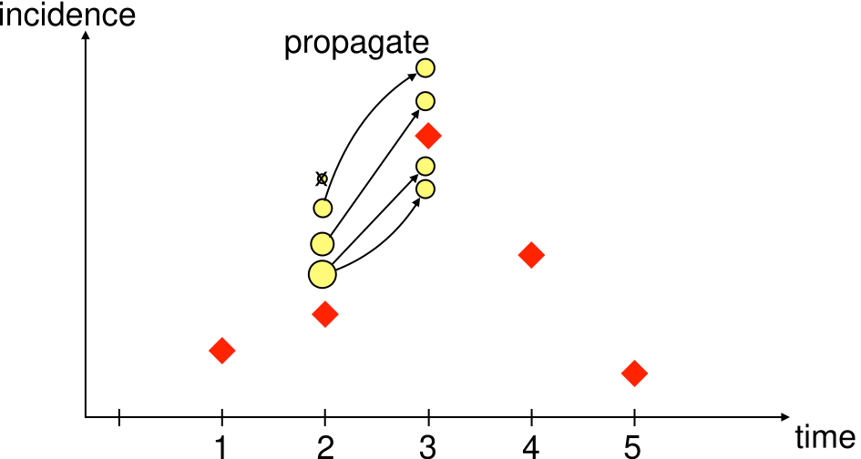{.pfwide .fragment .current-visible fragment-index=9}
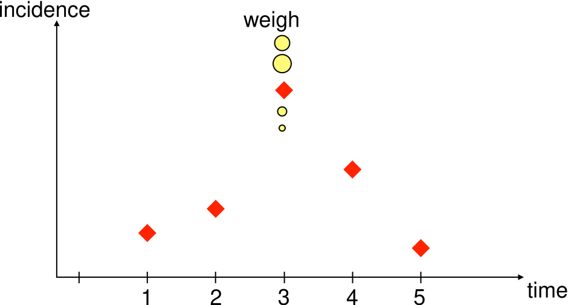{.pfwide .fragment .current-visible fragment-index=10}
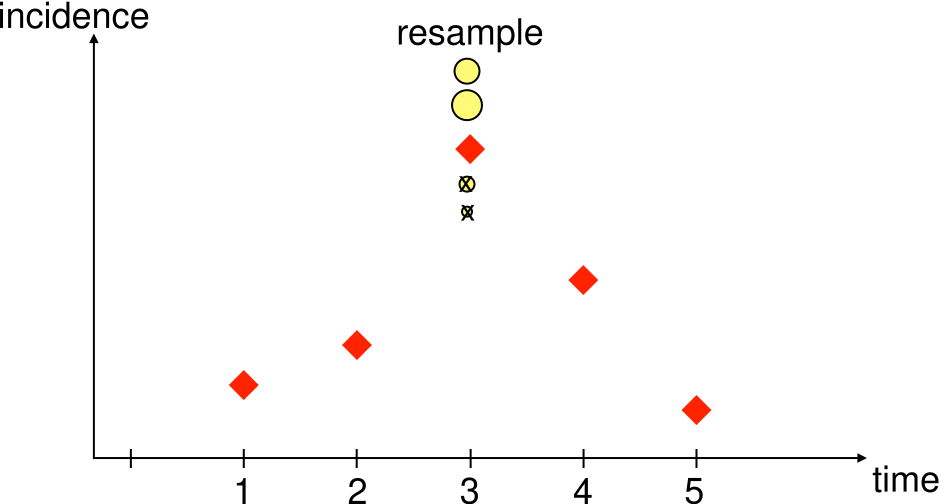{.pfwide .fragment .current-visible fragment-index=11}
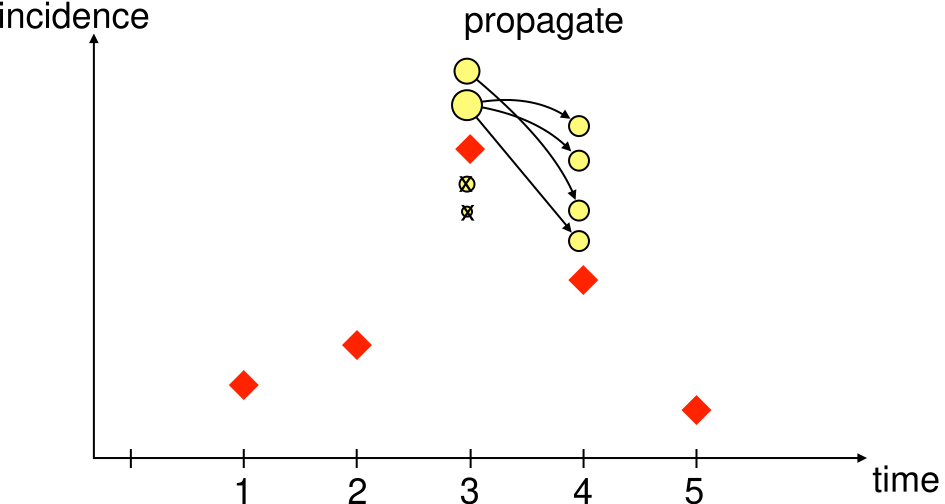{.pfwide .fragment .current-visible fragment-index=12}
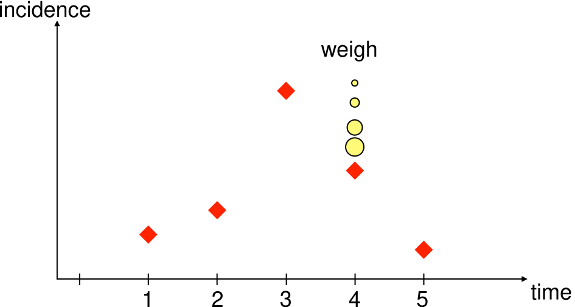{.pfwide .fragment .current-visible fragment-index=13}
{.pfwide .fragment .current-visible fragment-index=14}
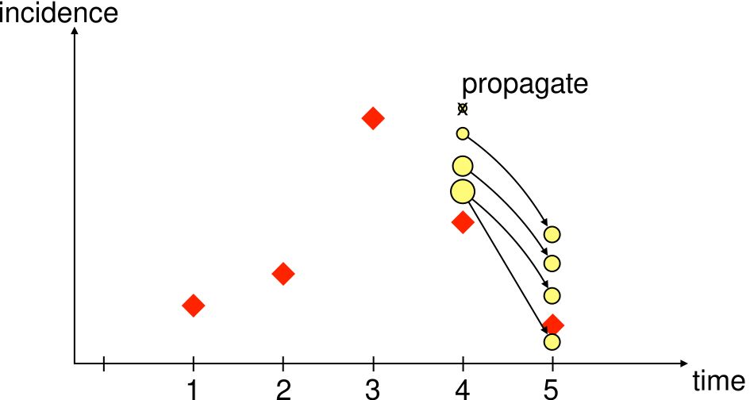{.pfwide .fragment .current-visible fragment-index=15}
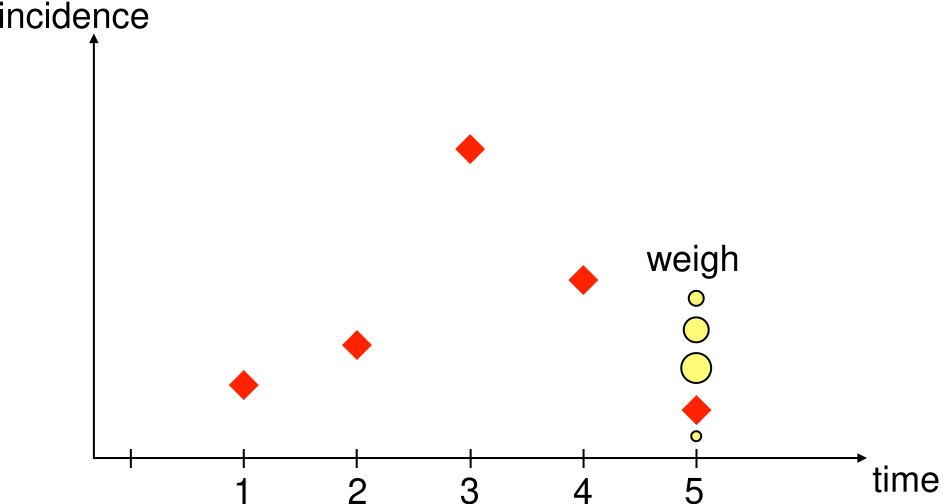{.pfwide .fragment .current-visible fragment-index=16}
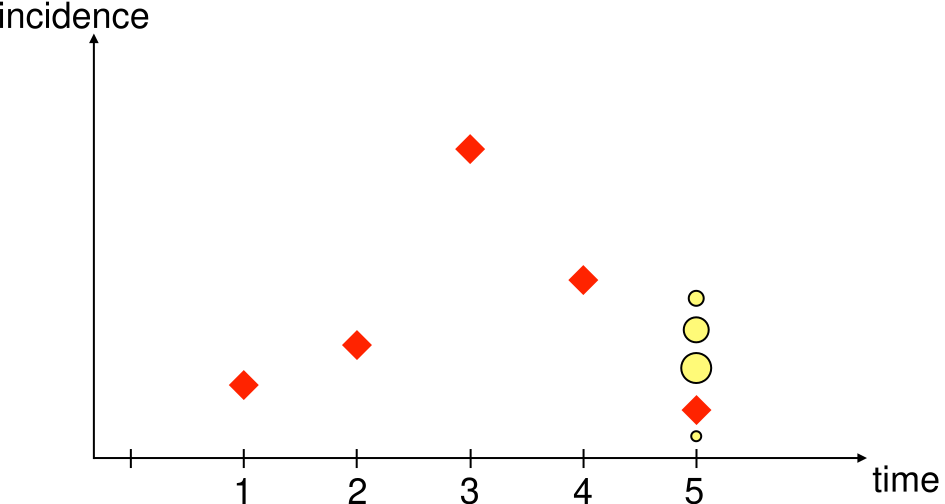{.pfwide .fragment .current-visible fragment-index=17}
{.pfwide .fragment fragment-index=18}
:::

::: {.stepstack}
[[**Initialise**]{.alert} $x_0 \sim p(x_0 \mid \theta), \quad w_0 = 1/J$]{.fragment .current-visible fragment-index=2}
[[**Propagate**]{.alert} $x_1 \sim p(x_1 \mid x_0, \theta)$]{.fragment .current-visible fragment-index=3}
[[**Weight**]{.alert} $w_1 = p(y_1 \mid x_1, \theta)$]{.fragment .current-visible fragment-index=4}
[[**Resample**]{.alert} in proportion to $w_1$]{.fragment .current-visible fragment-index=5}
[[**Propagate**]{.alert} $x_2 \sim p(x_2 \mid x_1, \theta)$]{.fragment .current-visible fragment-index=6}
[[**Weight**]{.alert} $w_2 = p(y_2 \mid x_2, \theta)$]{.fragment .current-visible fragment-index=7}
[[**Resample**]{.alert} in proportion to $w_2$]{.fragment .current-visible fragment-index=8}
[[**Propagate**]{.alert} $x_3 \sim p(x_3 \mid x_2, \theta)$]{.fragment .current-visible fragment-index=9}
[[**Weight**]{.alert} $w_3 = p(y_3 \mid x_3, \theta)$]{.fragment .current-visible fragment-index=10}
[[**Resample**]{.alert} in proportion to $w_3$]{.fragment .current-visible fragment-index=11}
[[**Propagate**]{.alert} $x_4 \sim p(x_4 \mid x_3, \theta)$]{.fragment .current-visible fragment-index=12}
[[**Weight**]{.alert} $w_4 = p(y_4 \mid x_4, \theta)$]{.fragment .current-visible fragment-index=13}
[[**Resample**]{.alert} in proportion to $w_4$]{.fragment .current-visible fragment-index=14}
[[**Propagate**]{.alert} $x_5 \sim p(x_5 \mid x_4, \theta)$]{.fragment .current-visible fragment-index=15}
[[**Weight**]{.alert} $w_5 = p(y_5 \mid x_5, \theta)$]{.fragment .current-visible fragment-index=16}
[[**Resample**]{.alert} in proportion to $w_5$]{.fragment .current-visible fragment-index=17}
[$\hat{p}(y \mid \theta) = \prod_{t} \frac{1}{J}\sum_{j} w_{t,j}$]{.fragment fragment-index=18}
:::

::: {.cite}
Four particles here.
Red diamonds are the data, yellow circles the particles, sized by weight, struck through when nobody resampled them.
:::

## The estimator

Average the weights each day, before resampling:

$$\hat{p}(y \mid \theta) = \prod_{t=1}^{T} \frac{1}{J}\sum_{j=1}^{J} w_{t,j}$$

. . .

The average runs over all $J$ particles, including the ones resampling is about to discard.
That is why resampling cannot inflate the estimate.

. . .

This is **sequential Monte Carlo**.

## Particle degeneracy

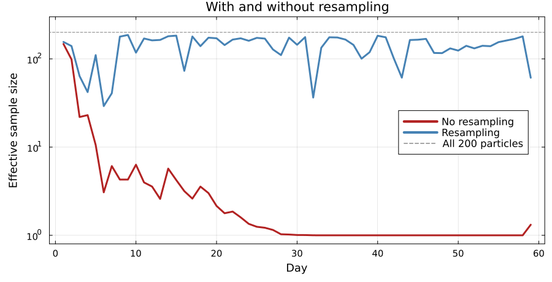{.pfwide}

Without resampling the effective sample size is 6 by day 10, and about 1 from day 30 on.

## Depletion

{.pfwide}

Follow the arrows back from day 5.
The survivors all descend from a few of the day 1 particles.

. . .

Early states end up represented by fewer and fewer distinct particles, which limits what the filter can say about the start of the epidemic.

## How many particles?

- Too few and the likelihood estimate is noisy, which will wreck the sampler that uses it.
- Too many and every likelihood evaluation becomes expensive.

. . .

The estimate is **unbiased** but **stochastic**.
Run it twice at the same $\theta$ and you get two different numbers.

. . .

Measure the spread of $\log \hat{p}$ at one $\theta$ and pick $J$ from that.
You do this in the practical.

## The whole thing, in code {.smaller .scrollable}

```julia
function bootstrap_filter(rng, θ, obs, n_particles; init_state)
    particles = [copy(init_state) for _ in 1:n_particles]
    loglik = 0.0

    for y in obs
        ## propagate: run every particle forward one day
        incidence = map(1:n_particles) do i
            particles[i], daily = gillespie_step(rng, particles[i], θ)
            daily
        end

        ## weight: how plausible is today's observation under each particle?
        log_w = logpdf.(Poisson.(θ[:ρ] .* incidence), y)

        ## accumulate: the mean weight estimates today's likelihood
        loglik += logsumexp(log_w) - log(n_particles)

        ## resample: keep the particles that explained the data
        w = exp.(log_w .- maximum(log_w))
        particles = particles[rand(rng, Categorical(w ./ sum(w)), n_particles)]
    end

    return loglik
end
```

In the practical you read this one line by line, then swap it for the bootstrap filter in `GeneralisedFilters.jl` behind the same interface.

##  Your Turn {background-color="#447099" transition="fade-in"}

In the practical you will

- see why a deterministic likelihood fails for a stochastic model
- watch particles propagate, get weighted, and be resampled
- read that filter line by line and work out what each step does
- explore how the number of particles affects the likelihood estimate


#

[Return to the session](../particle_filters.qmd)
