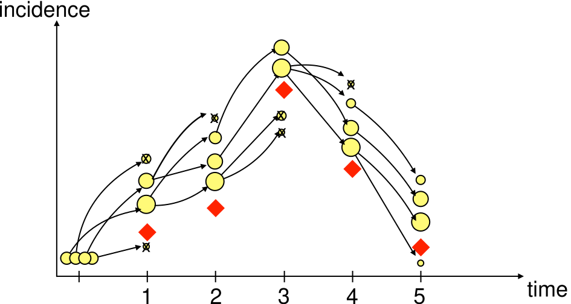
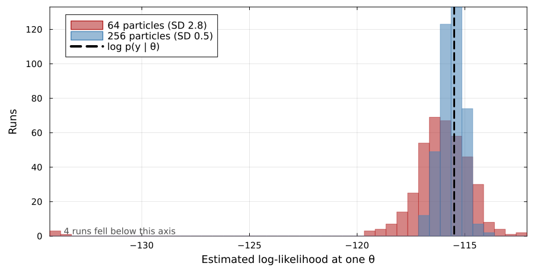
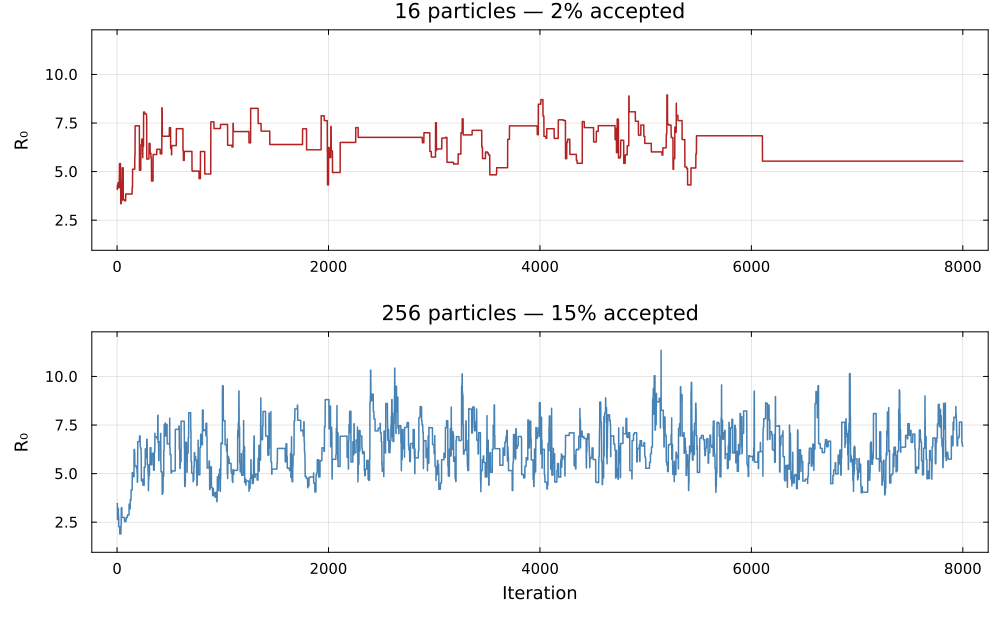
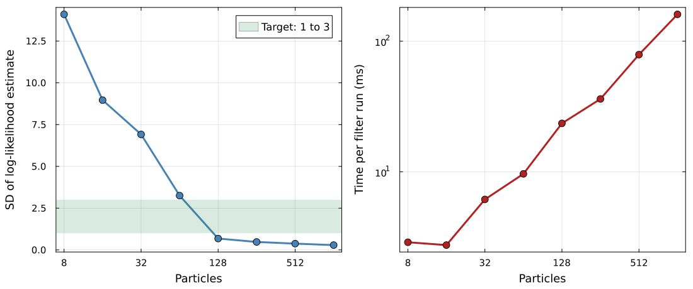

## Where we got to

{.pfwide}

$$\hat{p}(y \mid \theta) = \prod_{t} \frac{1}{J}\sum_{j=1}^{J} w_{t,j}$$

An estimate of the marginal likelihood at **one** $\theta$. We want the
**posterior** over $\theta$.

## Substituting the estimate

We already have an algorithm that explores a posterior using nothing but
likelihood evaluations: Metropolis-Hastings.

. . .

So: propose $\theta^*$, run a particle filter to get $\hat{p}(y \mid \theta^*)$,
and accept or reject as usual.

$$r = \min\left(1, \frac{\hat{p}(y \mid \theta^*)\, p(\theta^*)}{\hat{p}(y \mid \theta)\, p(\theta)}\right)$$

. . .

This is [particle marginal Metropolis-Hastings]{.alert} (PMMH).

## Why should that work at all?

Same $\theta$, same data, 400 runs of the filter — fed into an algorithm derived
assuming the [exact]{.alert} likelihood.

## The reason it works

The estimate is [unbiased]{.alert}:

$$\mathbb{E}\big[\hat{p}(y \mid \theta)\big] = p(y \mid \theta)$$

::: {.fragment}
The chain still targets the correct posterior — exactly, not approximately. The
noise costs us **efficiency**, never **correctness**.

::: {.cite}
@andrieu2010 — derived in the appendix
:::
:::

# The practical problem

## Noise makes the chain sticky

A lucky **high** estimate sits in the denominator of every later acceptance
ratio, so the chain rejects good proposals until something beats it.

## Choosing the number of particles

Tune $J$ so the standard deviation of the log likelihood estimate is roughly
[1 to 3]{.alert} at a representative $\theta$.

. . .

Measured here at the posterior mean. The estimator is noisier out in the tails
of the posterior, which is why the practical uses 256 rather than the 128 this
curve appears to license.

::: {.cite}
@pitt2012; @doucet2015
:::

## Why RAM rather than NUTS

- Resampling and discrete events make the likelihood **non-differentiable**:
  no gradient to follow.
- The filter returns a different number every run, so there is no fixed surface
  for HMC to integrate along.

. . .

Metropolis-Hastings survives the second because the estimate is unbiased. HMC
does not.

. . .

So we use **robust adaptive Metropolis**, which learns the proposal covariance
for us [@vihola2012].

## The pay-off

Everything from the deterministic part of the course now carries over to
stochastic models:

- posterior distributions over parameters
- credible intervals
- posterior predictive checks

. . .

And we get the latent trajectories for free: each accepted $\theta$ comes with a
sampled state path, which is **state estimation** alongside parameter
estimation.

## Comparing models

Is temporary immunity better described by one compartment or four?
No amount of sampling SEITL answers that: you have to fit both.

. . .

- **Posterior predictive checks**: which reproduces the features you care about?
- **DIC**: the deviance at the posterior mean, penalised by its spread across
  the posterior

. . .

Both ask only for the likelihood of the whole series, which is what the filter
returns. WAIC and LOO need $p(y_i \mid \theta)$ per observation, and a shared
stochastic trajectory leaves the observations dependent given $\theta$.

. . .

[The criterion that is appropriate for model comparison is determined by the
structure of the model.]{.alert}

##  Your Turn {background-color="#447099" transition="fade-in"}

In the practical you will

- assemble the particle filter and Metropolis-Hastings into PMMH
- run a short chain and see the poor mixing for yourself
- vary the particle count and watch the trade-off appear
- work with a pre-computed long chain, and compare against the deterministic fit
- compare SEITL against SEIT4L, from the pre-computed chains, with DIC and a
  posterior predictive check

# Appendix: why PMMH is exact

## Making the randomness explicit {.smaller}

The filter is random only because it consumes random numbers. Collect all of
them into one vector $u$:

- the draws that initialise the particles
- the noise that propagates each particle at each step
- the uniforms that drive resampling

. . .

Write $m(u)$ for their density. Because the propagation is a deterministic map
applied to standard draws, $m$ does not depend on $\theta$.

. . .

Given $u$, the filter is a [deterministic]{.alert} function:

$$\hat{p}(y \mid \theta) = \hat{p}(y \mid \theta, u)$$

## A distribution on the enlarged space {.smaller}

Define a joint density over the pair $(\theta, u)$:

$$\tilde{\pi}(\theta, u) = \frac{p(\theta)\, \hat{p}(y \mid \theta, u)\, m(u)}{p(y)}$$

. . .

Integrating $u$ out at fixed $\theta$ averages the estimator over its own
randomness, which is exactly what unbiasedness controls:

$$\int \hat{p}(y \mid \theta, u)\, m(u)\, \mathrm{d}u = \mathbb{E}\big[\hat{p}(y \mid \theta)\big] = p(y \mid \theta)$$

. . .

This is the [only]{.alert} place unbiasedness is used.

## The marginal is the posterior

It follows that $\tilde{\pi}$ integrates to one, and that

$$\int \tilde{\pi}(\theta, u)\, \mathrm{d}u = \frac{p(\theta)\, p(y \mid \theta)}{p(y)} = p(\theta \mid y)$$

. . .

The $\theta$-marginal of the enlarged target is the posterior we wanted.

## PMMH is Metropolis-Hastings on that target {.smaller}

Propose $\theta^*$ from $q(\cdot \mid \theta)$, then fresh random numbers
$u^* \sim m(\cdot)$. The Metropolis-Hastings ratio for $\tilde{\pi}$ under
that proposal is

$$\underbrace{\frac{p(\theta^*)}{p(\theta)} \cdot \frac{\hat{p}(y \mid \theta^*, u^*)}{\hat{p}(y \mid \theta, u)} \cdot \frac{m(u^*)}{m(u)}}_{\text{target}} \;\cdot\; \underbrace{\frac{q(\theta \mid \theta^*)}{q(\theta^* \mid \theta)} \cdot \frac{m(u)}{m(u^*)}}_{\text{proposal}}$$

. . .

The two $m$ factors are reciprocals, so they cancel, leaving

$$\frac{p(\theta^*)\, \hat{p}(y \mid \theta^*, u^*)\, q(\theta \mid \theta^*)}{p(\theta)\, \hat{p}(y \mid \theta, u)\, q(\theta^* \mid \theta)}$$

. . .

This is the acceptance ratio we started from. The random numbers never appear in
the implementation because their proposal density cancels against their target
density.

## What the argument gives {.smaller}

- It holds for [any]{.alert} number of particles, $J = 1$ included. Correctness
  never required $J$ to be large.
- The variance of $\hat{p}$ never entered, which is why noise costs efficiency
  alone.
- $u$ is part of the chain's state and changes only when a move is accepted. A
  lucky $u$ is carried until something beats it: the plateaus we saw earlier,
  seen from the enlarged space.

. . .

The condition worth naming is that $\tilde{\pi}$ must be a proper density, so the
estimator has to be non-negative and strictly positive wherever the posterior is.
Particle filter estimates satisfy this.

::: {.cite}
@andrieu2009; @andrieu2010
:::

#

[Return to the session](../pmcmc.qmd)
